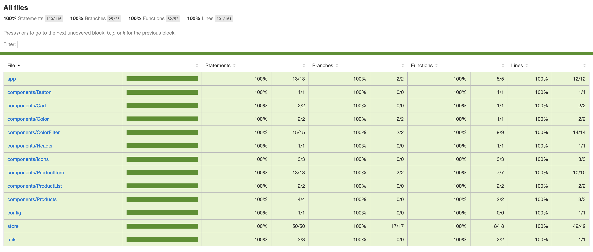

# E-Store


All components have complete code coverage and are fully unit tested. E2E tests are cypress based.

## Test

### Vitest Tests

```
npm run test
```

```
npm test coverage
```

### Cypress Tests

```
npm run cy:open
```

## Code Coverage



## Task

Objective: Create a basic product listing/basket page with data from https://my-json-server.typicode.com/benirvingplt/products/products

Format: Build and test a React application that implements the following user stories. Use whatever libraries you are most comfortable with.

PLT-1: Viewing product listings
Given I am on the home page
Then I am shown a list of product items (image, name, price, qty in bag)

PLT-2: Filter by colour
Given I am viewing all the product listings
When I choose to filter to show only black items
Then I am only shown listings for black items

PLT-3: Add to cart
Given I am viewing the products listings
When I press +
Then my basket qty for this item is incremented
And my total is updated to reflect the new items in my basket

PLT-3: Reduce quantity
Given I am viewing the products listings
When I press -
Then my basket qty for this item is decremented
And my total is updated to reflect the new items in my basket

PLT-4: Remove from basket
Given I am viewing the products listings
When I press remove
Then all items of this type are removed from my basket
And my total is updated to reflect the new items in my basket
